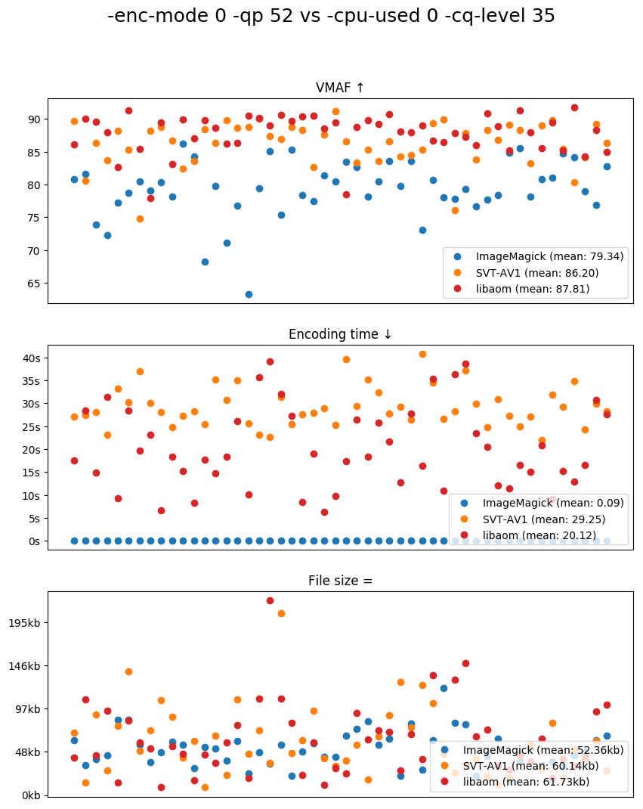

# av1-bench

AV1 encoders benchmarks for specific use-cases.

## Still-image

Comparision of libaom and SVT-AV1 for still-image coding (4:2:0) on subset1
from [derf's collection](https://media.xiph.org/video/derf/). JPEG files are
also encoded for the reference with ImageMagick (libjpeg).



## Usage

Setup make, FFmpeg, ImageMagick, VMAF, libaom, SVT-AV1 and run:

```
make
```

## TODO

* Add more metrics (PSNR, SSIM, etc.)
* Compare at different quality/speed

## License

[CC0](COPYING).
